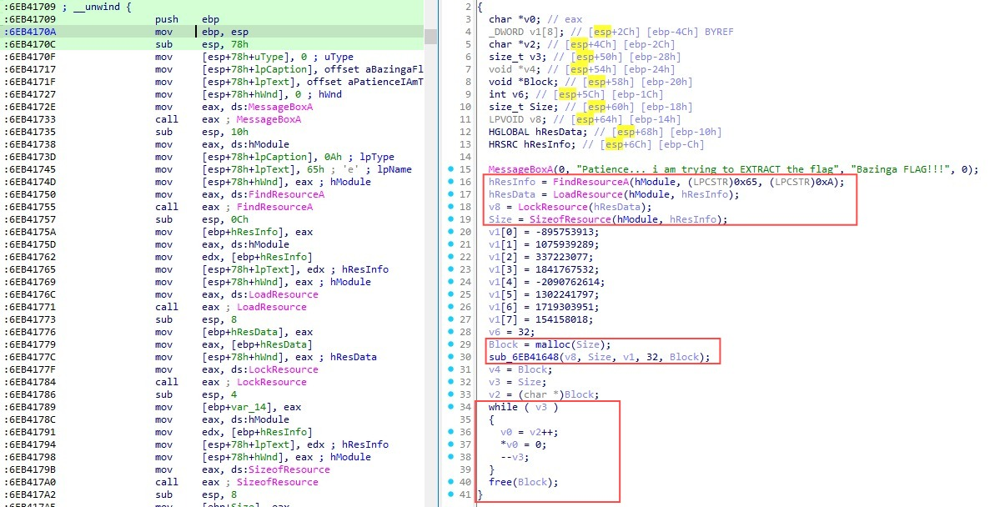

<style>
.logo-row {
  display: flex;
  justify-content: center;
  align-items: center;
  gap: 40px;
  margin-top: 30px;
}
.logo-row img {
  height: 160px;
}
</style>

<!-- _class: lead -->
# Dissecting DLL with Static and Dynamic Analysis
Shreethaar Arunagirinathan
@0x251e

<div class="logo-row">
  
  
  
</div>

---


### ./whoami

- Shreethaar Arunagirinathan 
- Computer Science @ UUM
- MCC 2024 Alumni 
- CTFs @ RE:UN10N 
    - DFIR
    - RE 
    - OSINT


---

### ./toc 

1. Case study of SEO#LURKER campaign
2. Why reversing DLL matters 
3. What is DLL 
4. How DLL works 
5. Create simple DLL 
6. Structure of DLL 
7. Static Analysis of DLL 
8. Dyanmic Analysis of DLL
9. CTF Challenge Walkthrough 
---

### ./case_study

<style>
div.twocols {
  margin-top: 35px;
  column-count: 2;
  font-size: 0.75em;
}
div.twocols p:first-child,
div.twocols h1:first-child,
div.twocols h2:first-child,
div.twocols ul:first-child,
div.twocols ul li:first-child,
div.twocols ul li p:first-child {
  margin-top: 0 !important;
}
div.twocols p.break {
  break-before: column;
  margin-top: 0;
}
div.twocols ul li {
  font-size: 0.85em;
  line-height: 1.5;
  margin-bottom: 0.4em;
}
.reference {
  font-size: 0.7em;
  color: #cccccc;
  margin-top: 10px;
  text-align: center;
}
</style>

<div class="twocols">

- **Target:** WinSCP users (430K searches/3 months) via fake Google Ads
- User downloads `WinSCP_v.6.1.zip` → runs `setup.exe`
- Appears legitimate: setup.exe = signed pythonw.exe ✅
- Hidden threat: python311.dll = MALICIOUS ❌

**The Deception**
- Traditional analysis: "Legitimate signed binary = safe"
- Reality: Malicious DLL sideloaded by legitimate process
- Full system compromise through DLL hijacking
- Persistence via scheduled tasks + more DLL chains

<p class="break"></p>


<p class="reference">References: <a href="https://www.iaesjournal.com/4980-2/">https://www.iaesjournal.com/4980-2/</a></p>
</div>

---

### ./why_reversing_dll_matters

<table>
<tr>
<td width="60%" valign="top">

- Modern malware uses DLL to employ various tactics  
    - [MITRE ATT&CK Hijack Execution Flow: DLL](https://attack.mitre.org/techniques/T1574/001/)  
- Common in reflective and process injections  
- More stealthy behavior and modular payloads  
- DLL is one of the top 5 file types listed in MalwareBazaar  
- Vulnerabilities analysis that lead to supply chain risks  
- Understand how applications interacts with external libraries  

</td>
<td width="60%" valign="top">


</td>
</tr>
</table>

---

### ./what_is_dll
<style>
section ul {
    font-size: 0.75em !important;
    line-height: 1.4;
}
section ul li {
    margin-bottom: 0.3em;
}
</style>

- DLL (Dynamic Link Library) contains code and data which used by more than one program at the same time
- Contains **exported functions** to be called by other modules
- Any process that uses Windows API uses dynamic linking:
    - Comdlg32 DLL use for dialog box related functions (GetOpenFileName, GetSaveFileName)
- Dynamic linking allows a module to include only the information needed to locate an exported DLL function at loadtime or runtime 
- Benefits of using DLL:
    - Reduce memory and disk usage as duplication of code is reduced
    - Promotes modular architecture, eases deployment and installation
- Security Matters with DLL:
    - Code sharing: Multiple applications can use the same DLL
    - Runtime Loading: DLLs loaded when needed (attack opportunity)
    - Modularity: Can be replaced or hijacked without changing main executable
---

### ./how_dll_works

Before understanding the working of DLL, understand the difference between static and dynamic linking:

- If **static linking** is used, the linker copies the **object code** from the library directly into the final executable. This results in a larger binary that is self-contained
- If **dynamic linking** is used, the linker does not copy the object code. Instead, it inserts **references (or stubs)** pointing to the external library (e.g., a DLL). 

In windows the file extensions are as follows: Static libraries (.lib) and dynamic libraries (.dll). The main difference is that static libraries are linked to the executable at compile time; whereas dynamic linked libraries are not linked until run-time.

---

### ./how_dll_works

[Static vs Dynamic Linking](https://excalidraw.com/#json=dnx_6hrE22l7_vI3D01Wh,N-eEl0y3luJclGzbXyOn4g)

[DLL Loading with Relative Addressing](https://excalidraw.com/#json=QSX9FTBqKW-Dk-h8LkWFW,12_4MgVhg96fA_Oo0sP99Q)

[DLL Load Flow](https://excalidraw.com/#json=mqTlKH5ZxO9CqZfisPyEO,tMmpjCvoIDcyNkKeoqaleg)

---

### ./create_simple_dll 
```c
// simple-dll.c
#include <windows.h>

/* Export a very small function */
__declspec(dllexport) int add(int a, int b) {
    return a+b;
}
__declspec(dllexport) char* getString() {
    static char buffer[] = "Hello from DLL";
    return buffer;
}
__declspec(dllexport) void processData(char* input, int length) {
    for(int i=0;i<length;i++) {
        input[i]^=0x42;
    }
}
BOOL WINAPI DllMain(HINSTANCE hinstDLL, DWORD fdwReason, LPVOID lpvReserved) {
    switch (fdwReason) {        // perform actions based on the reason of calling 
        case DLL_PROCESS_ATTACH:    // initialize once for each new process
            OutputDebugStringA("DLL Loaded\n");
            break;
        case DLL_THREAD_ATTACH:     // do thread-specific initialization
            break;
        case DLL_THREAD_DETACH:     // do thread-specific cleanup
            break;
        case DLL_PROCESS_DETACH:    // do not do cleanup if process termination scenario
        OutputDebugStringA("DLL Unloaded\n");
            break;
        }
        return TRUE;
}
```
---

### ./create_simple_dll
```c 
// simple-loader.c
#include <windows.h>
#include <stdio.h>
#include <string.h>
typedef int (*add_func_t)(int, int);
typedef void (*processData_func_t)(char*, int);

int main(void) {
    char string[] = "Hello from EXE";
    printf("%s\n", string);
    const char* dllName = "simple-dl.dll"; /* the DLL filename */
    HMODULE h = LoadLibraryA(dllName);
    if (!h) {
        DWORD err = GetLastError();
        printf("LoadLibraryA failed (error %lu). Make sure %s is in the same folder.\n", err, dllName);
        return 1;
    }
    add_func_t add = (add_func_t)GetProcAddress(h, "add");
    if (!add) {
        DWORD err = GetLastError();
        printf("GetProcAddress failed (error %lu).\n", err);
        FreeLibrary(h);
        return 1;
    }
    int a = 7, b = 5;
    int result = add(a, b);
    printf("add(%d, %d) = %d\n", a, b, result);

    processData_func_t processData = (processData_func_t)GetProcAddress(h, "processData");
    if (!processData) {
        printf("GetProcAddress for processData failed.\n");
    } else {
        char testData[] = "yappare is the best hacker\n";
        printf("Original: %s\n", testData);
        processData(testData, 6);
        printf("Processed: %s\n", testData);
    }
    FreeLibrary(h);
    return 0;
}
```
---

### ./structure_of_dll

##### DLL File Structure Overview
1. DOS Stub - Legacy DOS compatibility header 
2. PE Signature - "PE\0\0" magic Signature
3. COFF File Header - Machine type, number of sections, characteristics
4. Optional Header - Magic number, entry point, base address, RVA 
5. Section Headers - Sections names, virtual address, offset

---

### ./structure_of_dll

1. View COFF headers 
```cmd 
dumpbin /headers simple-dll.dll
```

2. Examine code sections
```cmd
dumpbin /rawdata /section:.text simple-dll.dll
dumpbin /disasm /section:.text simple-dll.dll
```

3. Export information 
```cmd 
dumpbin /exports simple-dll.dll 
```
---

### ./structure_of_dll

4. View dependecies 
```cmd 
dumpbin /dependents loader.exe 
```

5. View imports 
```cmd
dumpbin /imports loader.exe
```
---

### ./static_analysis_dll 

---

### ./dynamic_analysis_dll

---

### ./ctf_challenge_walkthrough


---

### ./ctf_challenge_walkthrough 


---

### ./ctf_challenge_walkthrough

 

---
### ./ctf_challenge_walkthrough

 

---

<span style="font-size:14px;">

### ./ctf_challenge_walkthrough

**Key information derived from IDA:**
1. Two exported functions: Run() and VoidFunc() 
2. **VoidFunc()** contains WinAPI that retrieved something from resource section of the DLL
3. v1 byte block (32-bit) passed to function **sub_6EB41648**
4. In sub_6EB41648 function, contain XOR operation
5. **while(v3)** loop is clearing **v0** which is EAX by replacing it will 0 (*v0 = 0)

</span>

---

<span style="font-size:14px;">

### ./ctf_challenge_walkthrough

**Next step:**
1. Run x32dbg with rundll32 (C:\Windows\SysWOW64\rundll32.exe)
2. Command line: "C:\Windows\SysWOW64\rundll32.exe" C:\Users\flarevm\Desktop\RE-DLL\challenge\Helper.dll,VoidFunc
3. Breakpoint before while loop and after sub_6EB41648 
4. Inspect memory what is contained

</span>

---

### ./ctf_challenge_walkthrough

 

---

### ./ctf_challenge_walkthrough 


---

### ./ctf_challenge_walkthrough


---

### ./ctf_challenge_walkthrough


---

### ./ctf_challenge_walkthrough


---

### ./ctf_challenge_walkthrough

 

---

### ./ctf_challenge_walkthrough

 

---

### ./ctf_challenge_walkthrough

 

---

### ./references 
1. [Everything You Ever Wanted to Know about DLLs - CppCon](https://www.youtube.com/watch?v=JPQWQfDhICA)
2. [Reversing DLLs - CactusCon](https://www.youtube.com/watch?v=ADWjaDhYR8k)
3. [LoadLibraryA - MSDN](https://learn.microsoft.com/en-us/windows/win32/api/libloaderapi/nf-libloaderapi-loadlibrarya)
4. [GetProcAddress - MSDN](https://learn.microsoft.com/en-us/windows/win32/api/libloaderapi/nf-libloaderapi-getprocaddress) 
5. [Thomas Roccia - Medium](https://blog.securitybreak.io/reverse-engineering-tip-analyzing-a-dll-in-x64dbg-b3005d516049) 

---

### ./the_end.sh 


